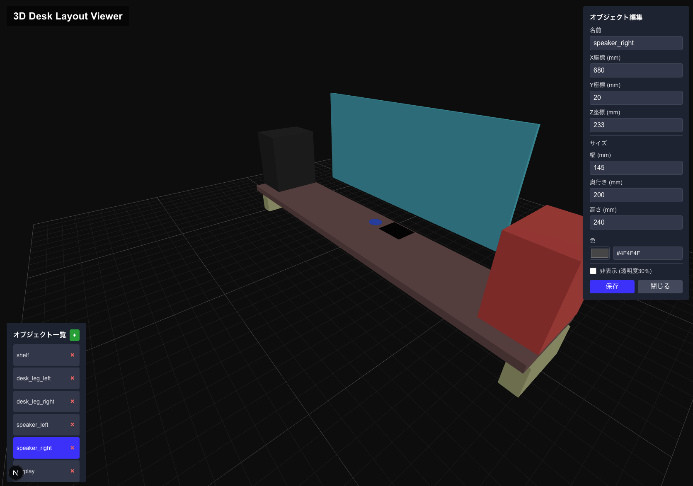

# Sample 3D View

Next.js と React Three Fiber で構築された 3D 机レイアウトビューアー。インタラクティブな 3D 環境で机のセットアップを可視化・編集できます。

## ✨ 機能

- 🎯 **インタラクティブ 3D 可視化** - リアルな 3D 空間で机のレイアウトを表示
- 🖱️ **クリックして編集** - オブジェクトを選択してプロパティを変更
- 📐 **リアルタイム編集** - 位置、サイズ、色、表示状態を即座に調整
- 🎨 **カラーピッカー** - ビジュアルピッカーまたは hex/rgba 値での色選択
- 👁️ **オブジェクトの表示/非表示** - 非表示時は 30% 透明度で表示切り替え
- 💾 **YAML 設定** - 人間が読みやすい YAML 形式で全レイアウトを保存
- 📱 **レスポンシブデザイン** - 目に優しいダークテーマ UI

## 🚀 デモ



## 🛠️ 技術スタック

- **Next.js 15** - App Router を使用した React フレームワーク
- **React Three Fiber** - Three.js の React レンダラー
- **@react-three/drei** - React Three Fiber の便利なヘルパー
- **TypeScript** - 型安全な開発
- **Tailwind CSS** - ユーティリティファースト CSS フレームワーク
- **js-yaml** - 設定ファイル用 YAML パーサー

## 📦 インストール

1. リポジトリをクローン:
```bash
git clone https://github.com/jey3dayo/sample-3d-view.git
cd sample-3d-view
```

2. 依存関係をインストール:
```bash
pnpm install
# または
npm install
# または
yarn install
```

3. 開発サーバーを起動:
```bash
pnpm dev
# または
npm run dev
# または
yarn dev
```

4. ブラウザで [http://localhost:3000](http://localhost:3000) を開く

## 🎮 使用方法

### 基本操作
- **回転**: 左クリック + ドラッグ
- **ズーム**: マウスホイール または ピンチ
- **パン**: 右クリック + ドラッグ

### オブジェクト編集
1. **選択**: 3D ビュー内のオブジェクトをクリック
2. **編集**: 右側のフォームパネルで以下を変更:
   - 名前
   - 位置 (X, Y, Z 座標、mm単位)
   - サイズ (幅、奥行き、高さ、mm単位)
   - 色 (カラーピッカー または テキスト入力)
   - 表示状態 (表示/非表示の切り替え)
3. **保存**: "保存" ボタンをクリックして変更を保存

### 設定
机のレイアウトは `public/desk-layout-3d.yaml` で定義されています。以下の方法で変更できます:
- ファイルを直接編集
- Web インターフェースで変更
- YAML 構造を拡張して新しいオブジェクトを追加

## 📄 YAML 構造

```yaml
elements:
  - name: desktop             # デスク天板
    type: box
    position: [100, 0, 650]   # [x, y, z] mm単位
    size: [1300, 250, 25]     # [幅, 奥行き, 高さ] mm単位
    color: "rgba(139, 69, 19, 0.3)"
    hidden: false             # 表示状態（オプション）

  - name: monitor_stand       # モニタースタンド
    type: cylinder
    position: [650, 125, 675]
    radius: 50                # mm単位
    height: 100               # mm単位
    color: "#2F4F4F"
```

## 🏗️ プロジェクト構造

```text
src/
├── app/
│   ├── actions.ts          # YAML保存用サーバーアクション
│   ├── layout.tsx          # ルートレイアウト
│   └── page.tsx            # メインページ
├── components/
│   └── DeskViewer3D.tsx    # メイン3Dビューアーコンポーネント
public/
└── desk-layout-3d.yaml     # 机設定ファイル
```

## 🎨 カスタマイズ

### 新しいオブジェクトタイプの追加
新しい3D形状をサポートするには、`Element3D` 型を拡張し、`DeskElement` コンポーネントにレンダリングロジックを追加してください。

### 座標系
- **X**: 左から右 (mm)
- **Y**: 手前から奥 (mm)
- **Z**: 下から上 (mm)
- **原点**: デスク天板の左手前角

### スタイリング
インターフェースはダークテーマの Tailwind CSS を使用しています。コンポーネントファイルで色やレイアウトをカスタマイズできます。

## 🤝 コントリビューション

1. リポジトリをフォーク
2. 機能ブランチを作成: `git checkout -b feature/amazing-feature`
3. 変更をコミット: `git commit -m 'Add amazing feature'`
4. ブランチにプッシュ: `git push origin feature/amazing-feature`
5. プルリクエストを開く

## 📝 ライセンス

このプロジェクトはオープンソースで、[MIT License](LICENSE) の下で利用可能です。

## 🙏 謝辞

- [React Three Fiber](https://docs.pmnd.rs/react-three-fiber) で構築
- [@react-three/drei](https://github.com/pmndrs/drei) の 3D ヘルパーを使用
- 実際の机セットアップ可視化ニーズにインスパイア

---

❤️ と ☕ で作られました by [jey3dayo](https://github.com/jey3dayo)
